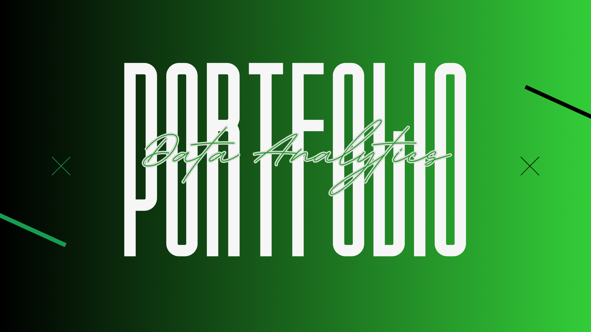
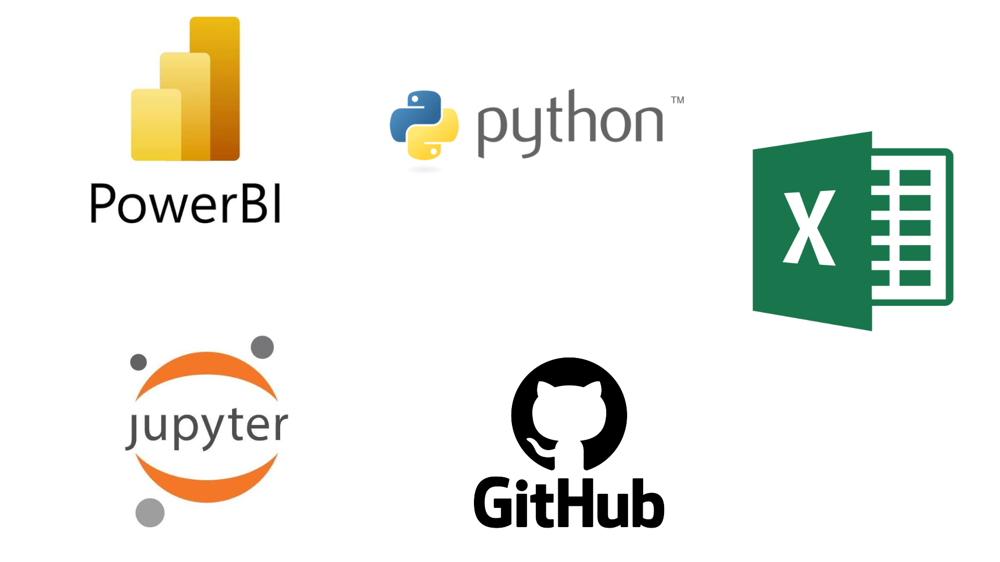
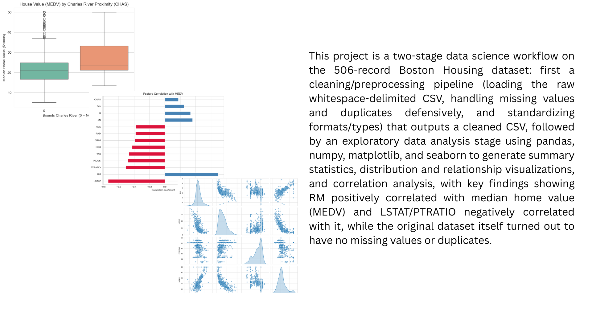
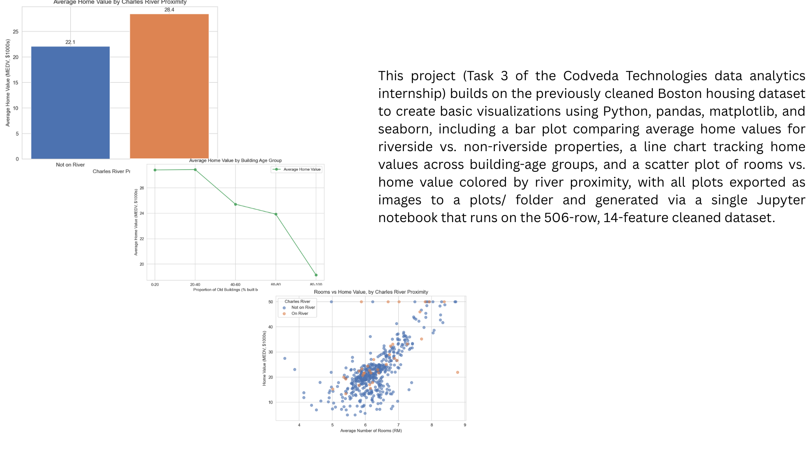
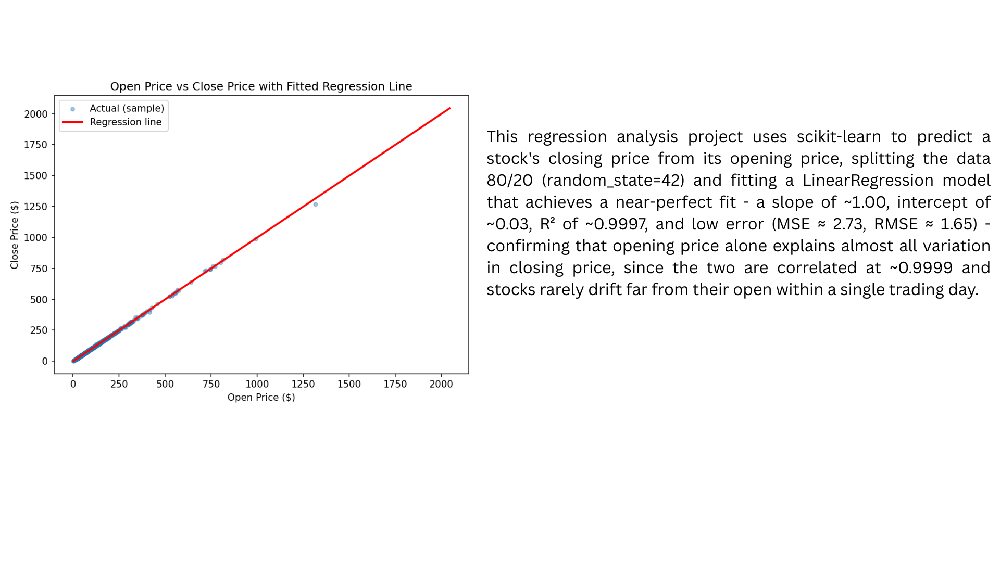
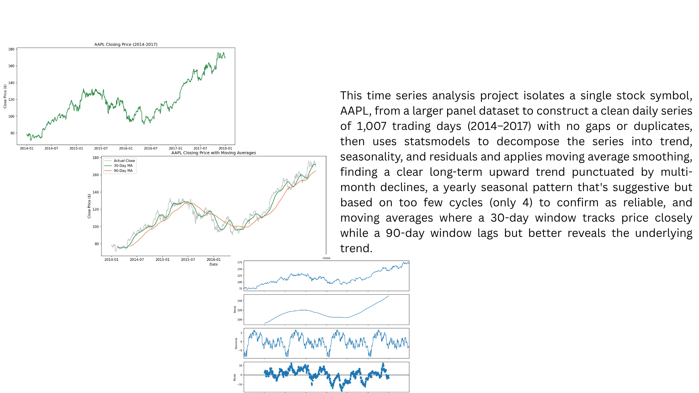
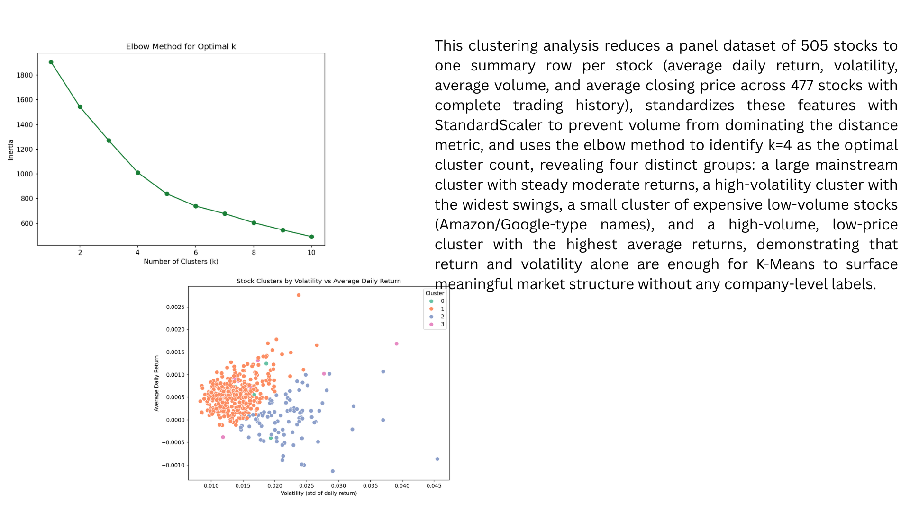
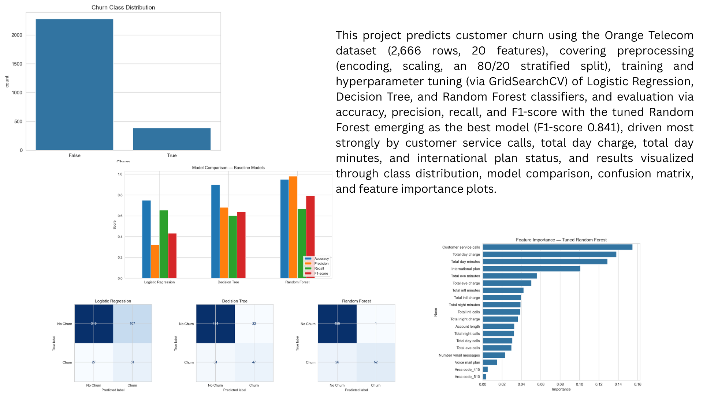
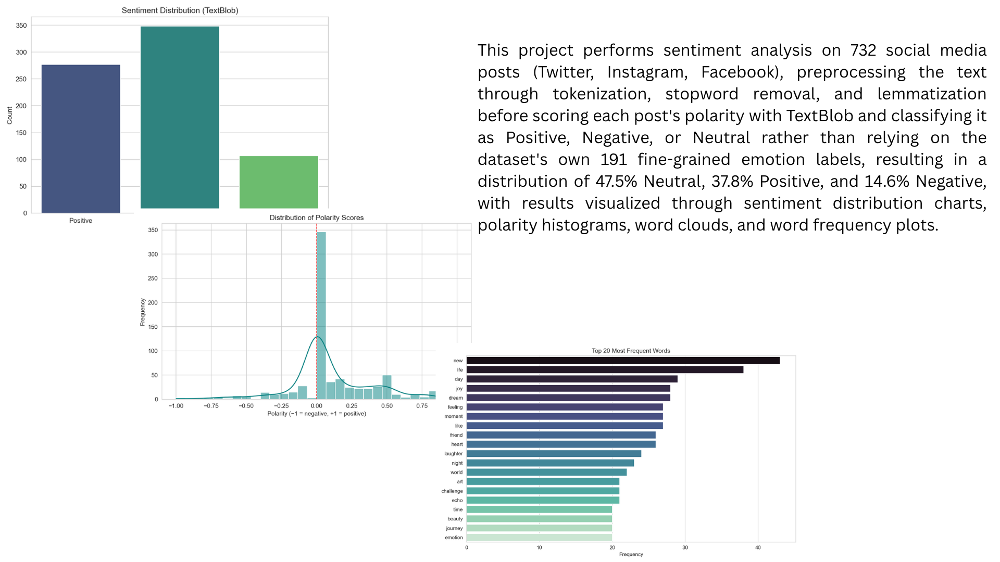

<table width="100%" style="width:100%; border-collapse:collapse; table-layout:fixed;">
<tr>

<td width="22%" valign="top" align="center" style="padding:24px; background-color:#000000; color:#ffffff;">

<h2 style="color:#ffffff;">OFILWE GABAITSE</h2>
<h3 style="color:#ffffff;">Data Analyst</h3>

  

  

  

</td>

<td width="3%"></td>

<td valign="top" style="padding:24px;">

<a href="#about" style="color:#1a7f37; text-decoration:underline;"><b>About</b></a> &nbsp;•&nbsp;
<a href="#skills" style="color:#1a7f37; text-decoration:underline;"><b>Skills</b></a> &nbsp;•&nbsp;
<a href="#projects" style="color:#1a7f37; text-decoration:underline;"><b>Internship Projects</b></a> &nbsp;•&nbsp;
<a href="#contact" style="color:#1a7f37; text-decoration:underline;"><b>Contact</b></a>

<h2 id="about" style="color:#1a7f37;">ABOUT</h2>

I'm a final-year Business Intelligence and Data Analytics student with a passion for turning raw data into meaningful insights. My work sits at the intersection of analytical thinking and practical problem-solving, whether that's writing clean Python pipelines, building visual dashboards, or applying machine learning to real-world questions. This portfolio showcases projects completed across different levels of complexity, from foundational data work to predictive modeling and NLP.

<h2 id="skills" style="color:#1a7f37;">TOOLS</h2>

<!-- Add or swap badges anytime — find icons at https://shields.io and https://simpleicons.org -->

<h2 id="projects" style="color:#1a7f37;">INTERNSHIP PROJECTS</h2>

<h3>Codveda Technologies Internship Projects</h3>

The following projects were completed as part of a virtual data analytics internship with Codveda Technologies, a company specializing in IT solutions including AI/ML automation and data analysis. The internship was structured across three progressive levels, and the projects below reflect work done across all three.

<h4>Level 1: Foundational Analytics</h4>
<ul>
<li><strong>Data Cleaning and Preprocessing</strong></li>
<li><strong>Exploratory Data Analysis (EDA)</strong></li>
<li><strong>Basic Data Visualization</strong></li>  
</ul>
<h4>Level 2: Intermediate Analysis</h4>
<ul>
<li><strong>Regression Analysis</strong></li>  
<li><strong>Time Series Analysis</strong></li>
<li><strong>Clustering Analysis (K-Means)</strong></li>
</ul>
<h4>Level 3: Advanced Projects</h4>
<ul>
<li><strong>Predictive Modeling (Classification)</strong></li>
<li><strong>Building Dashboards with PowerBI</strong></li>  
<li><strong>Sentiment Analysis (NLP)</strong></li>
</ul>

<h3>Level 1 House Price Prediction: Exploratory Data Analysis</h3>

<strong>Built with:</strong> 

<a href="https://github.com/OFILWE560/Data-Cleaning_EDA/blob/main/house_price_prediction.ipynb">View Full Notebook →</a>

 

<h3>Basic Data Visualization</h3>

<strong>Built with:</strong> 

<a href="https://github.com/OFILWE560/Basic-Data-Visualization/blob/main/data_visualization.ipynb">View Full Notebook →</a>

 

<h3>Level 2 Regression Analysis: Predicting Stock Close Price from Open Price</h3>

<strong>Built with:</strong> 

<a href="https://github.com/OFILWE560/regression_analysis/blob/main/regression%20analysis.ipynb">View Full Notebook →</a>

<h3>Time Series Analysis: Decomposing AAPL's Four-Year Price Story</h3>

<strong>Built with:</strong> 

<a href="https://github.com/OFILWE560/Stock-Analytics/blob/main/Time%20Series.ipynb">View Full Notebook →</a>

<h3>Clustering Analysis: What Do Stocks Actually Group By?</h3>

<strong>Built with:</strong> 

<a href="https://github.com/OFILWE560/Stock-Analytics/blob/main/Clustering%20Analysis.ipynb">View Full Notebook →</a>

<h3>Predictive Modelling: Customer Churn Prediction</h3>

<strong>Built with:</strong> 

<a href="https://github.com/OFILWE560/Predictive-Modelling/blob/main/%20Predictive%20Modeling.ipynb">View Full Notebook →</a>

<h3>Natural Language Processing: Sentiment Analysis</h3>

<strong>Built with:</strong> 

<a href="https://github.com/OFILWE560/Sentiment-Analysis-/blob/main/Sentiment%20Analysis%20.ipynb">View Full Notebook →</a>

<h2 id="contact" style="color:#1a7f37;">CONTACT</h2>

I'm happy to connect, reach out through any of the links below.

<a href="https://www.linkedin.com/in/ofilwe-gabaitse/">LinkedIn</a> ·
<a href="mailto:ofilwegabaitse@gmail.com">Email</a> ·
<a href="https://github.com/OFILWE560">GitHub</a> ·
<a href="tel:+26777555757">+267 77 555 757</a>

Last updated June 2026

</td>

</tr>
</table>

