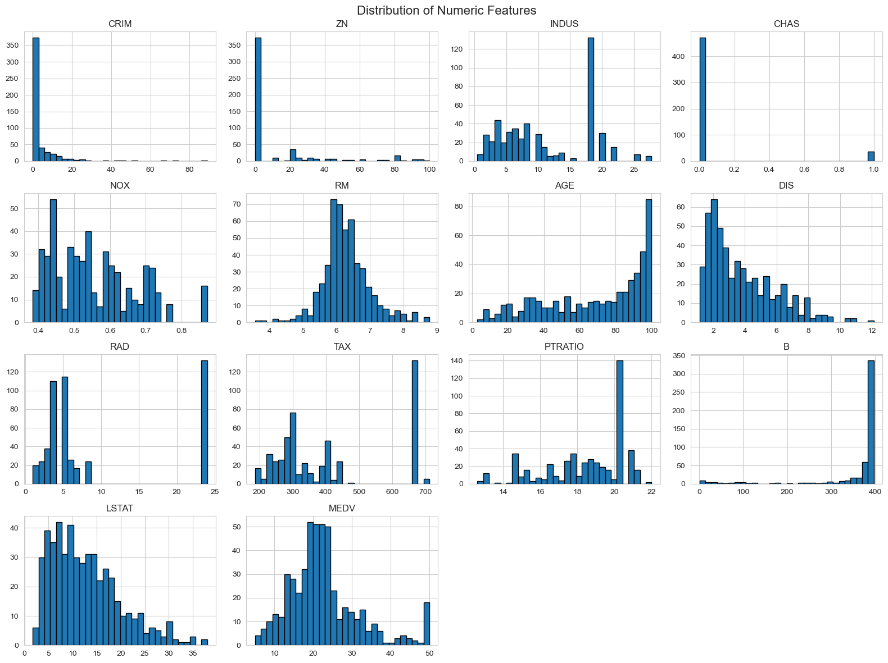
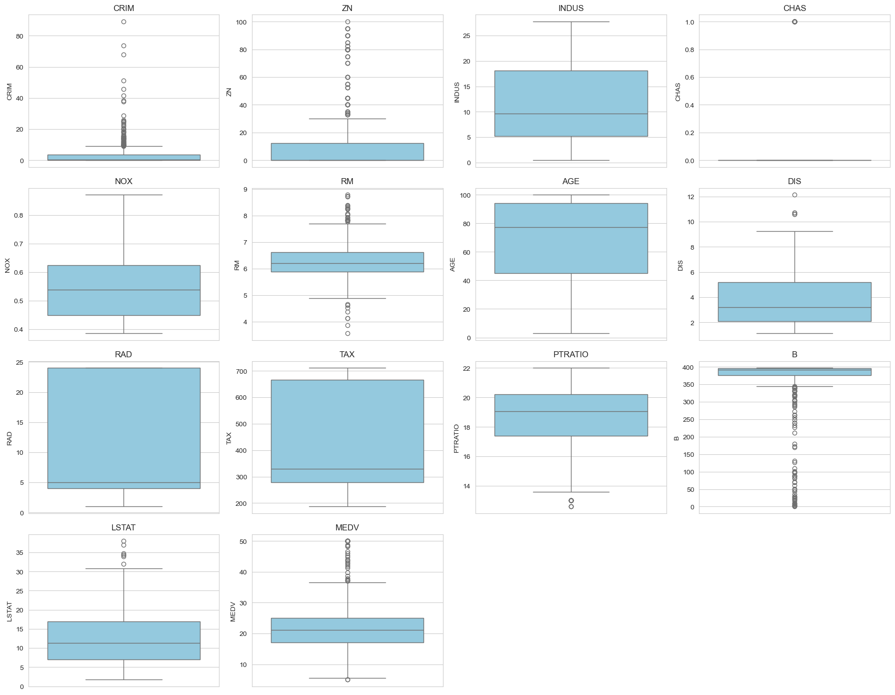
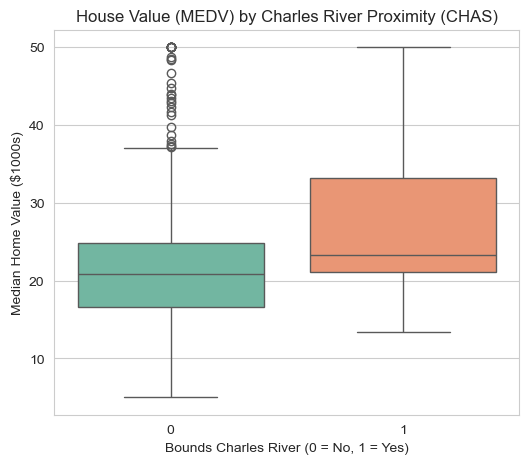
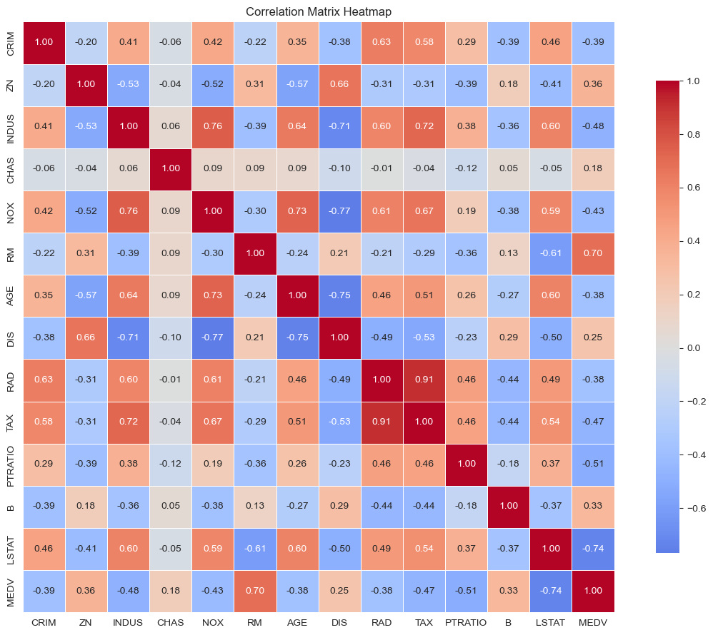
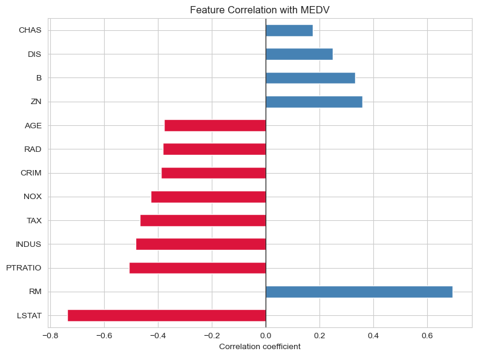
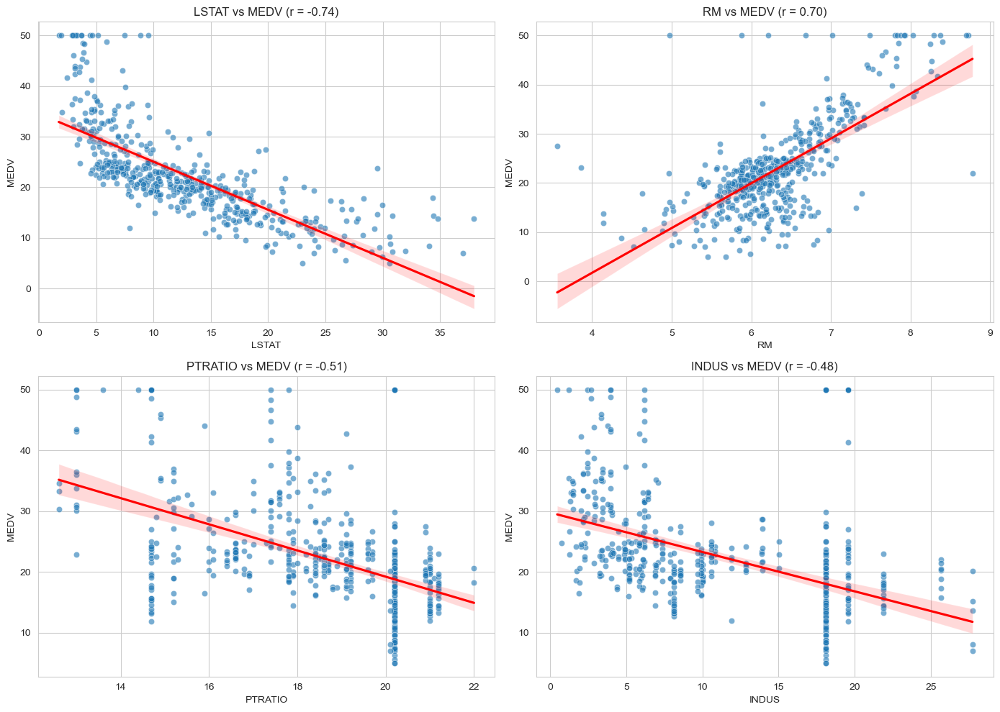
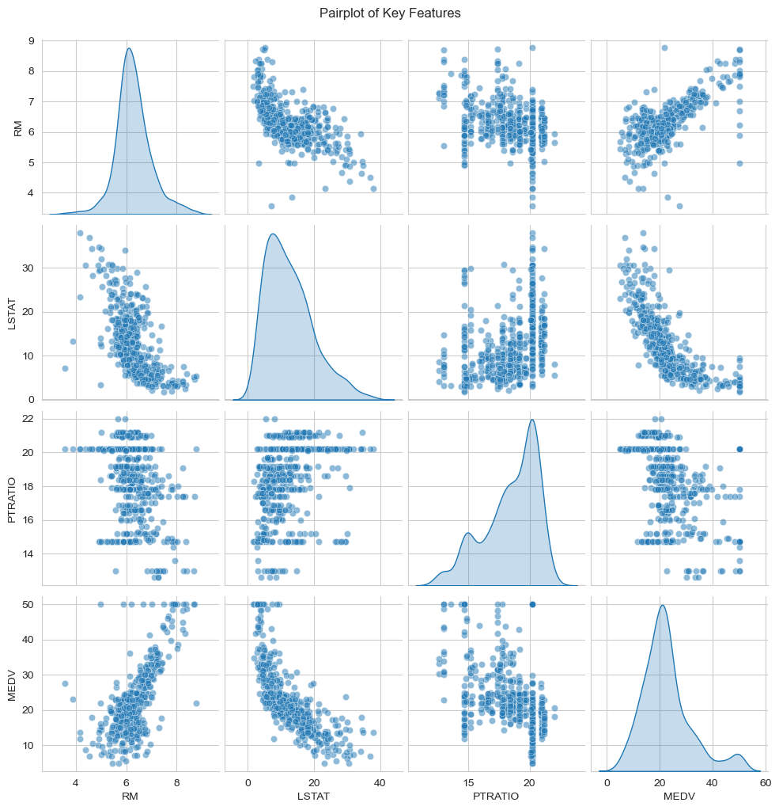

<table width="100%" style="width:100%; border-collapse:collapse; table-layout:fixed;">
<tr>

<td width="22%" valign="top" align="center" style="padding:24px; background-color:#000000; color:#ffffff;">

<h2 style="color:#ffffff;">OFILWE GABAITSE</h2>
<h3 style="color:#ffffff;">Data Analyst</h3>

  

  

  

<a href="tel:+26777555757" style="color:#ffffff;">📞 +267 77 555 757</a>

</td>

<td width="3%"></td>

<td valign="top" style="padding:24px;">

<a href="#about" style="color:#1a7f37; text-decoration:underline;"><b>About</b></a> &nbsp;•&nbsp;
<a href="#skills" style="color:#1a7f37; text-decoration:underline;"><b>Skills</b></a> &nbsp;•&nbsp;
<a href="#projects" style="color:#1a7f37; text-decoration:underline;"><b>Projects</b></a> &nbsp;•&nbsp;
<a href="#contact" style="color:#1a7f37; text-decoration:underline;"><b>Contact</b></a>

<h2 id="about" style="color:#1a7f37;">ABOUT</h2>

I'm a final-year Business Intelligence and Data Analytics student with a passion for turning raw data into meaningful insights. My work sits at the intersection of analytical thinking and practical problem-solving, whether that's writing clean Python pipelines, building visual dashboards, or applying machine learning to real-world questions. This portfolio showcases projects completed across different levels of complexity, from foundational data work to predictive modeling and NLP.

<h3>Codveda Technologies Internship Projects</h3>

The following projects were completed as part of a virtual data analytics internship with Codveda Technologies, a company specializing in IT solutions including AI/ML automation and data analysis. The internship was structured across three progressive levels, and the projects below reflect work done across all three.

<h4>Level 1: Foundational Analytics</h4>
<ul>
<li><strong>Data Cleaning and Preprocessing</strong></li>
<li><strong>Exploratory Data Analysis (EDA)</strong></li>
</ul>
<h4>Level 2: Intermediate Analysis</h4>
<ul>
<li><strong>Time Series Analysis</strong></li>
<li><strong>Clustering Analysis (K-Means)</strong></li>
</ul>
<h4>Level 3: Advanced Projects</h4>
<ul>
<li><strong>Predictive Modeling (Classification)</strong></li>
<li><strong>Sentiment Analysis (NLP)</strong></li>
</ul>

<h2 id="skills" style="color:#1a7f37;">SKILLS</h2>

<strong>Python Libraries</strong>

<!-- Add or swap badges anytime — find icons at https://shields.io and https://simpleicons.org -->

<h2 id="projects" style="color:#1a7f37;">PROJECTS</h2>

<h3>House Price Prediction: Exploratory Data Analysis</h3>

Every data analytics project follows a lifecycle: <strong>define the problem → collect the data → clean it → explore it → analyze/model it → communicate the findings</strong>. This project lives at the cleaning-and-exploration stage, the bridge between raw, messy data and a model anyone could actually trust. Skip this stage and you're modeling on guesswork; do it properly, and every decision made later (which features matter, which model to pick, how confident to be in the result) becomes evidence-based instead of a shot in the dark. Working with the classic 506-row Boston housing dataset, I started with the unglamorous but essential basics checking data types, scanning for missing values and duplicates, standardizing column names the kind of housekeeping that, if skipped, quietly corrupts everything built on top of it. From there, the exploration below began.

<h4>1. Distribution Analysis</h4>

This is the first thing any analyst should do with a new dataset: look at the shape of every variable at once. Histograms reveal whether a feature is roughly symmetric, skewed, or clustered into spikes, and that shape decides what you can safely do with the data later, a heavily skewed feature like CRIM, for instance, usually needs a log transform before it's fed into a model. <strong>Benefit:</strong> it surfaces these quirks in seconds, before they quietly break a model further down the line.

<h4>2. Outlier Detection</h4>

Boxplots compress each feature into five key numbers, minimum, lower quartile, median, upper quartile, maximum and flag anything beyond that range as a potential outlier. Outliers aren't automatically "bad data"; sometimes they're the most interesting rows in the set. But an analyst needs to know they exist before deciding whether to keep, cap, or remove them. <strong>Benefit:</strong> several features here (CRIM, ZN, B) showed sharp outliers, flagging exactly where extra care would be needed before modeling.

<h4>3. Group Comparison</h4>

Sometimes the most useful question isn't "what's the distribution?" but "does this category change the outcome?" Here I compared home values for properties that border the Charles River against those that don't. <strong>Benefit:</strong> the visual makes the price gap immediately obvious, riverside homes trend noticeably higher turning a simple yes/no column into a real pricing signal worth keeping for any future model.

<h4>4. Correlation Mapping</h4>

A correlation heatmap is the analyst's shortcut for spotting relationships across an entire dataset at a glance color does the work that scanning dozens of numbers can't. Deep red and deep blue cells call out features that move strongly together, while pale cells confirm two variables barely affect each other. <strong>Benefit:</strong> beyond highlighting what drives price, it also exposes risky overlaps, TAX and RAD correlate at 0.91, a warning sign for multicollinearity that any modeling step would need to account for.

<h4>5. Feature Ranking</h4>

Once you know features are related to each other, the next question is "related to what matters?" This chart ranks every feature purely by how strongly it correlates with home value (MEDV), from strongest to weakest. <strong>Benefit:</strong> it turns a 13-feature dataset into a clear shortlist, RM (rooms) and LSTAT (% lower-status population) stand out as the two strongest levers on price, exactly the kind of prioritization that keeps a modeling phase focused instead of throwing every column at the wall.

<h4>6. Relationship Confirmation</h4>

Correlation gives you a number; a scatterplot shows the actual shape of that relationship, and shape matters, because a straight-line relationship is treated very differently from a curved one. Plotting the four strongest features against price, with a regression line over each, confirms whether that correlation number reflects something genuinely linear or something more complicated. <strong>Benefit:</strong> it validates that RM and LSTAT really do trend linearly with price, giving real confidence to use them as-is in a future linear model.

<h4>7. Multivariate View</h4>

Real-world outcomes are rarely explained by one variable in isolation, so the final step zooms out to see several features at once. A pairplot lays every pairwise relationship side by side, with each feature's own distribution running down the diagonal. <strong>Benefit:</strong> it's the clearest single view of how rooms, deprivation level, and school staffing ratios jointly shape price, exactly the kind of summary that makes the case for which features deserve to carry into a predictive model next.

<strong>Built with:</strong> Python · pandas · seaborn · matplotlib

<a href="house_price_prediction/house_price_prediction.ipynb">View Full Notebook →</a>

 

<h3><a href="https://github.com/OFILWE560/project-two">Project Two Name</a></h3>

A short description of this project and what you learned building it.

<strong>Built with:</strong> Python · Flask

<a href="https://github.com/OFILWE560/project-two">View Repo →</a> &nbsp;|&nbsp; <a href="https://OFILWE560.github.io/project-two">Live Demo →</a>

 

<h3><a href="https://github.com/OFILWE560/project-three">Project Three Name</a></h3>

A short description of this project.

<strong>Built with:</strong> Power BI · SQL

<a href="https://github.com/OFILWE560/project-three">View Repo →</a> &nbsp;|&nbsp; <a href="https://OFILWE560.github.io/project-three">Live Demo →</a>

<h2 id="contact" style="color:#1a7f37;">CONTACT</h2>

I'm happy to connect, reach out through any of the links below.

<a href="https://www.linkedin.com/in/ofilwe-gabaitse/">LinkedIn</a> ·
<a href="mailto:ofilwegabaitse@gmail.com">Email</a> ·
<a href="https://github.com/OFILWE560">GitHub</a> ·
<a href="tel:+26777555757">+267 77 555 757</a>

Last updated June 2026

</td>

</tr>
</table>

