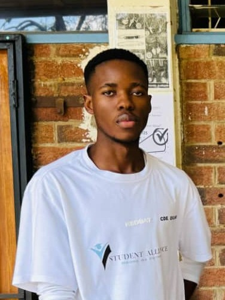
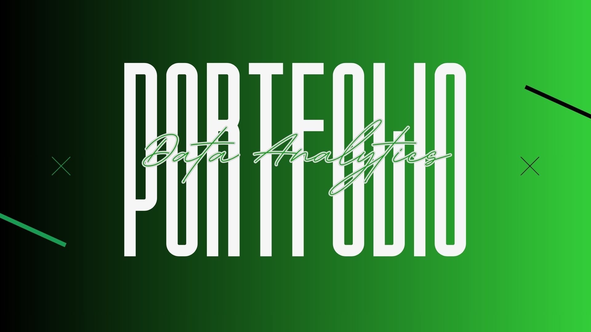

<table width="100%" style="width:100%; border-collapse:collapse; table-layout:fixed;">
<tr>

<td width="22%" valign="top" align="center" style="padding:24px; background-color:#000000; color:#ffffff;">

<h2 style="color:#ffffff;">OFILWE GABAITSE</h2>
<h3 style="color:#ffffff;">Data Analyst</h3>

  

  

  

<a href="tel:+26777555757" style="color:#ffffff;">📞 +267 77 555 757</a>

</td>

<td width="3%"></td>

<td valign="top" style="padding:24px;">

<a href="#about" style="color:#1a7f37; text-decoration:underline;"><b>About</b></a> &nbsp;•&nbsp;
<a href="#skills" style="color:#1a7f37; text-decoration:underline;"><b>Skills</b></a> &nbsp;•&nbsp;
<a href="#projects" style="color:#1a7f37; text-decoration:underline;"><b>Projects</b></a> &nbsp;•&nbsp;
<a href="#contact" style="color:#1a7f37; text-decoration:underline;"><b>Contact</b></a>

<h2 id="about" style="color:#1a7f37;">ABOUT</h2>

I'm a final-year Business Intelligence and Data Analytics student with a passion for turning raw data into meaningful insights. My work sits at the intersection of analytical thinking and practical problem-solving, whether that's writing clean Python pipelines, building visual dashboards, or applying machine learning to real-world questions. This portfolio showcases projects completed across different levels of complexity, from foundational data work to predictive modeling and NLP.

<h3>Codveda Technologies Internship Projects</h3>

The following projects were completed as part of a virtual data analytics internship with Codveda Technologies, a company specializing in IT solutions including AI/ML automation and data analysis. The internship was structured across three progressive levels, and the projects below reflect work done across all three.

<h4>Level 1: Foundational Analytics</h4>

<strong>Data Cleaning and Preprocessing</strong> - Worked with a raw CSV dataset containing missing values, duplicates, and inconsistent formatting. Used Python and pandas to handle missing data through imputation and removal, eliminate duplicate records, and standardize formats across date and categorical fields.

<strong>Exploratory Data Analysis (EDA)</strong> - Conducted a full exploratory analysis to surface patterns and trends in a dataset. Computed summary statistics and produced histograms, boxplots, and scatter plots using matplotlib and seaborn, including correlation analysis across numerical features.

<h4>Level 2: Intermediate Analysis</h4>

<strong>Time Series Analysis</strong> - Analyzed a time-series dataset to detect trends and seasonality. Used statsmodels to decompose the series into its constituent components and applied moving average smoothing to clarify underlying patterns.

<strong>Clustering Analysis (K-Means)</strong> - Applied K-Means clustering to group data points by feature similarity. Standardized the dataset with StandardScaler, used the elbow method to determine the optimal number of clusters, and visualized the results with 2D scatter plots.

<h4>Level 3: Advanced Projects</h4>

<strong>Predictive Modeling (Classification)</strong> - Built and evaluated multiple classification models - including Decision Trees, Logistic Regression, and Random Forest - to predict categorical outcomes. Assessed performance using accuracy, precision, recall, and F1-score, and optimized the best-performing model through grid search hyperparameter tuning.

<strong>Sentiment Analysis (NLP)</strong> - Performed sentiment analysis on text data using nltk and TextBlob. Preprocessed the corpus through tokenization, stopword removal, and lemmatization, then classified sentiments and visualized frequency distributions with word clouds.

<h2 id="skills" style="color:#1a7f37;">SKILLS</h2>

<strong>Python Libraries</strong>

<!-- Add or swap badges anytime — find icons at https://shields.io and https://simpleicons.org -->

<h2 id="projects" style="color:#1a7f37;">PROJECTS</h2>

<h3><a href="https://github.com/OFILWE560/project-one">Project One Name</a></h3>

A short description: what the project does, the problem it solves, and any notable details.

<strong>Built with:</strong> HTML · CSS · JavaScript

<a href="https://github.com/OFILWE560/project-one">View Repo →</a> &nbsp;|&nbsp; <a href="https://OFILWE560.github.io/project-one">Live Demo →</a>

 

<h3><a href="https://github.com/OFILWE560/project-two">Project Two Name</a></h3>

A short description of this project and what you learned building it.

<strong>Built with:</strong> Python · Flask

<a href="https://github.com/OFILWE560/project-two">View Repo →</a> &nbsp;|&nbsp; <a href="https://OFILWE560.github.io/project-two">Live Demo →</a>

 

<h3><a href="https://github.com/OFILWE560/project-three">Project Three Name</a></h3>

A short description of this project.

<strong>Built with:</strong> Power BI · SQL

<a href="https://github.com/OFILWE560/project-three">View Repo →</a> &nbsp;|&nbsp; <a href="https://OFILWE560.github.io/project-three">Live Demo →</a>

<h2 id="contact" style="color:#1a7f37;">CONTACT</h2>

I'm happy to connect, reach out through any of the links below.

<a href="https://www.linkedin.com/in/ofilwe-gabaitse/">LinkedIn</a> ·
<a href="mailto:ofilwegabaitse@gmail.com">Email</a> ·
<a href="https://github.com/OFILWE560">GitHub</a> ·
<a href="tel:+26777555757">+267 77 555 757</a>

Last updated June 2026

</td>

</tr>
</table>

