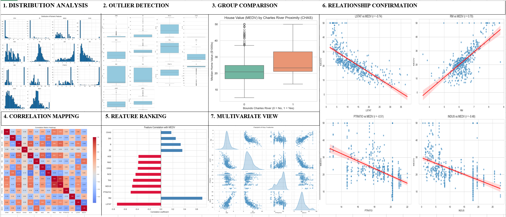
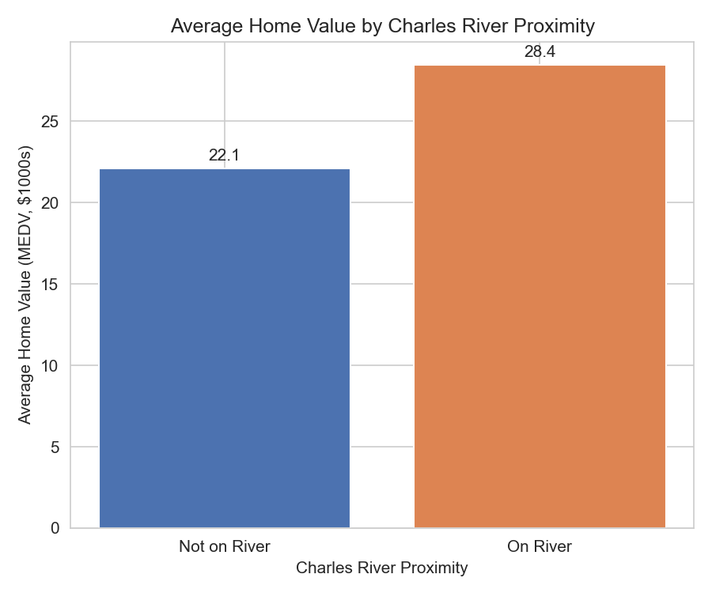
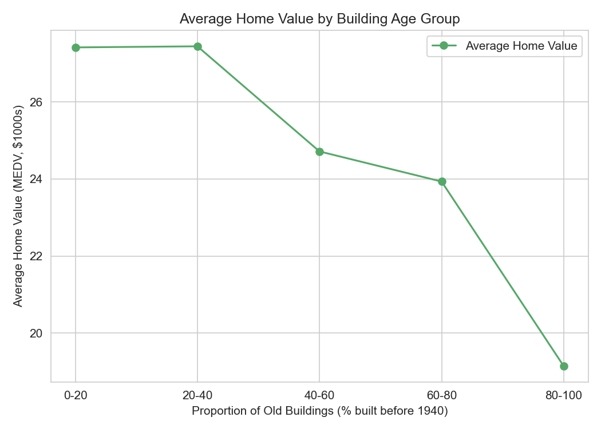
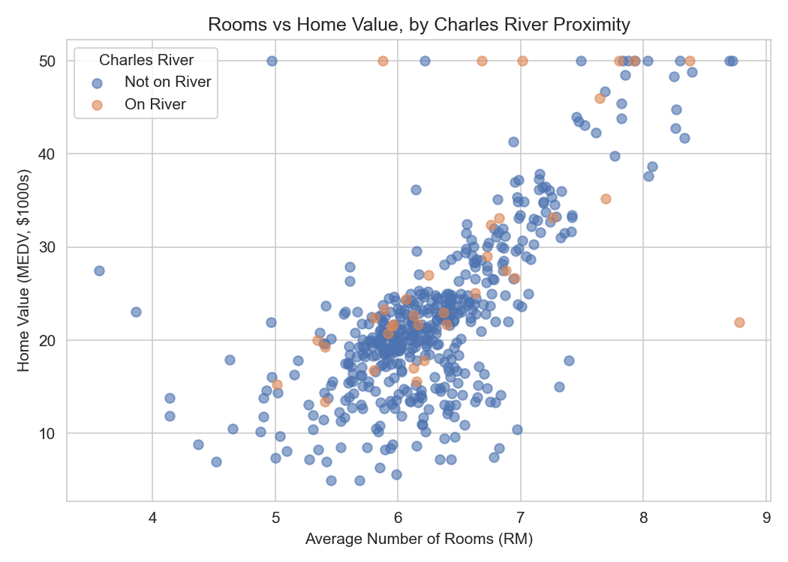
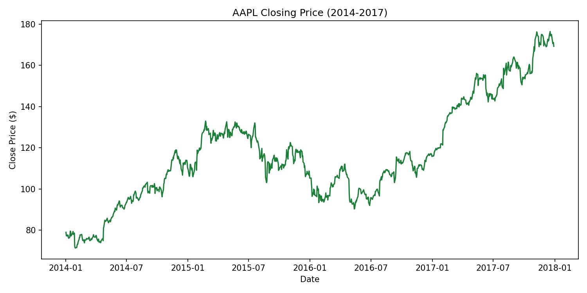
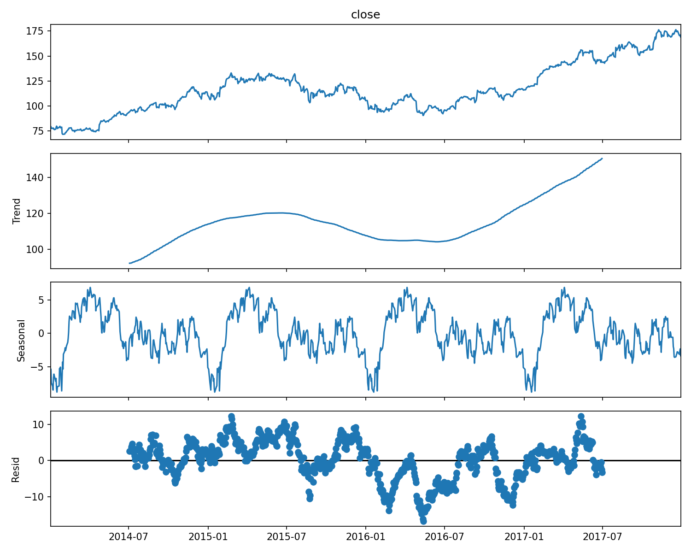
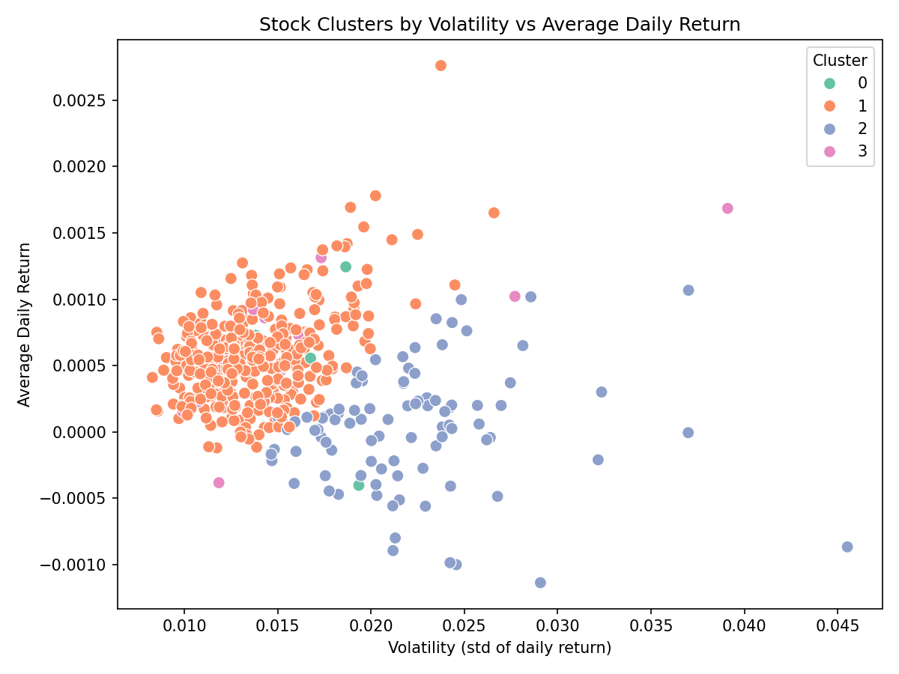

<table width="100%" style="width:100%; border-collapse:collapse; table-layout:fixed;">
<tr>

<td width="22%" valign="top" align="center" style="padding:24px; background-color:#000000; color:#ffffff;">

<h2 style="color:#ffffff;">OFILWE GABAITSE</h2>
<h3 style="color:#ffffff;">Data Analyst</h3>

  

  

  

</td>

<td width="3%"></td>

<td valign="top" style="padding:24px;">

<a href="#about" style="color:#1a7f37; text-decoration:underline;"><b>About</b></a> &nbsp;•&nbsp;
<a href="#skills" style="color:#1a7f37; text-decoration:underline;"><b>Skills</b></a> &nbsp;•&nbsp;
<a href="#projects" style="color:#1a7f37; text-decoration:underline;"><b>Internship Projects</b></a> &nbsp;•&nbsp;
<a href="#contact" style="color:#1a7f37; text-decoration:underline;"><b>Contact</b></a>

<h2 id="about" style="color:#1a7f37;">ABOUT</h2>

I'm a final-year Business Intelligence and Data Analytics student with a passion for turning raw data into meaningful insights. My work sits at the intersection of analytical thinking and practical problem-solving, whether that's writing clean Python pipelines, building visual dashboards, or applying machine learning to real-world questions. This portfolio showcases projects completed across different levels of complexity, from foundational data work to predictive modeling and NLP.

<h2 id="skills" style="color:#1a7f37;">SKILLS</h2>

<strong>Python Libraries</strong>

<!-- Add or swap badges anytime — find icons at https://shields.io and https://simpleicons.org -->

<h2 id="projects" style="color:#1a7f37;">INTERNSHIP PROJECTS</h2>

<h3>Codveda Technologies Internship Projects</h3>

The following projects were completed as part of a virtual data analytics internship with Codveda Technologies, a company specializing in IT solutions including AI/ML automation and data analysis. The internship was structured across three progressive levels, and the projects below reflect work done across all three.

<h4>Level 1: Foundational Analytics</h4>
<ul>
<li><strong>Data Cleaning and Preprocessing</strong></li>
<li><strong>Exploratory Data Analysis (EDA)</strong></li>
<li><strong>Basic Data Visualization</strong></li>  
</ul>
<h4>Level 2: Intermediate Analysis</h4>
<ul>
<li><strong>Regression Analysis</strong></li>  
<li><strong>Time Series Analysis</strong></li>
<li><strong>Clustering Analysis (K-Means)</strong></li>
</ul>
<h4>Level 3: Advanced Projects</h4>
<ul>
<li><strong>Predictive Modeling (Classification)</strong></li>
<li><strong>Building Dashboards with PowerBI</strong></li>  
<li><strong>Sentiment Analysis (NLP)</strong></li>
</ul>

<h3>House Price Prediction: Exploratory Data Analysis</h3>

Working with the classic 506-row Boston housing dataset, I started by parsing the raw whitespace-delimited file, naming all 14 columns, and checking data types, missing values, and duplicates. The handful of missing values found were imputed with each column's median, exact duplicate rows were dropped, and every column was force-coerced to numeric, including a validity check that CHAS only ever takes values of 0 or 1, and RAD stays an integer to catch anything that had slipped through as text or a stray format issue. That housekeeping, unglamorous but essential, is what makes every plot below trustworthy. From there, the exploration captured in the dashboard below began.

The numbers below walk through the dashboard panel by panel, in the order the analysis actually unfolded:

<table style="width:100%; border-collapse:collapse;">
<tr style="background-color:#1a7f37; color:#ffffff; text-align:left;">
<th style="padding:10px; border:1px solid #ddd; width:4%;">#</th>
<th style="padding:10px; border:1px solid #ddd; width:20%;">Step</th>
<th style="padding:10px; border:1px solid #ddd;">What it shows</th>
</tr>
<tr>
<td style="padding:10px; border:1px solid #ddd;">1</td>
<td style="padding:10px; border:1px solid #ddd;"><strong>Distribution Analysis</strong></td>
<td style="padding:10px; border:1px solid #ddd;">Histograms across all 14 features to check shape and skew before any transformation. CRIM and a few others came back heavily right-skewed, flagging exactly where a log transform would be needed before modeling.</td>
</tr>
<tr style="background-color:#f6f8fa;">
<td style="padding:10px; border:1px solid #ddd;">2</td>
<td style="padding:10px; border:1px solid #ddd;"><strong>Outlier Detection</strong></td>
<td style="padding:10px; border:1px solid #ddd;">The same 14 features as boxplots, laid out in a grid to catch outliers a histogram can hide. CRIM, ZN, and B showed sharp outliers, marking exactly where extra care would be needed before modeling.</td>
</tr>
<tr>
<td style="padding:10px; border:1px solid #ddd;">3</td>
<td style="padding:10px; border:1px solid #ddd;"><strong>Group Comparison</strong></td>
<td style="padding:10px; border:1px solid #ddd;">A boxplot comparing home values for properties that border the Charles River against those that don't. Riverside homes trend noticeably higher, turning a simple yes/no column into a real pricing signal worth keeping for any future model.</td>
</tr>
<tr style="background-color:#f6f8fa;">
<td style="padding:10px; border:1px solid #ddd;">4</td>
<td style="padding:10px; border:1px solid #ddd;"><strong>Correlation Mapping</strong></td>
<td style="padding:10px; border:1px solid #ddd;">A full correlation heatmap across all 14 features to see what moves together. TAX and RAD stood out at 0.91, a multicollinearity risk worth flagging before any modeling step.</td>
</tr>
<tr>
<td style="padding:10px; border:1px solid #ddd;">5</td>
<td style="padding:10px; border:1px solid #ddd;"><strong>Feature Ranking</strong></td>
<td style="padding:10px; border:1px solid #ddd;">Every feature's correlation with home value (MEDV), ranked as a horizontal bar chart. RM (rooms, r = 0.70) and LSTAT (% lower-status population, r = -0.74) emerged as the two strongest levers on price, the clear shortlist for modeling.</td>
</tr>
<tr style="background-color:#f6f8fa;">
<td style="padding:10px; border:1px solid #ddd;">6</td>
<td style="padding:10px; border:1px solid #ddd;"><strong>Relationship Confirmation</strong></td>
<td style="padding:10px; border:1px solid #ddd;">The four most strongly correlated features, LSTAT, RM, PTRATIO, and INDUS, plotted against price with regression lines to check linearity. RM and LSTAT both trend cleanly linear, confirming they're safe to use as-is in a future linear model.</td>
</tr>
<tr>
<td style="padding:10px; border:1px solid #ddd;">7</td>
<td style="padding:10px; border:1px solid #ddd;"><strong>Multivariate View</strong></td>
<td style="padding:10px; border:1px solid #ddd;">A pairplot of rooms, lower-status population, pupil-teacher ratio, and price to see how they interact together, not just pairwise. It's the clearest single view of how these factors jointly shape price.</td>
</tr>
</table>

<strong>Built with:</strong> Python · pandas · seaborn · matplotlib

<a href="https://github.com/OFILWE560/Data-Cleaning_EDA/blob/main/house_price_prediction.ipynb">View Full Notebook →</a>

 

<h3>Basic Data Visualization</h3>

A direct follow-on from the EDA project above: same cleaned 506-row Boston housing dataset, now used to build and customize a core set of plot types bar, line, and scatter and export them as report-ready images. Where the EDA project asked "what's in this data, and can I trust it?", this one asks "what story does it tell once it's clean?"

<h4>1. Bar Plot: Charles River Proximity</h4>

Average home value for properties on vs. off the Charles River, with the exact figure labeled directly on each bar. Riverside homes average around $28,400 against roughly $22,100 everywhere else, a gap of about $6,300, or nearly 29% higher just for sitting next to the river. It's the same trend spotted as a boxplot comparison in the EDA project, but turning it into two labeled bars makes the size of that premium impossible to miss.

<h4>2. Line Chart: Home Value by Building Age</h4>

Average home value plotted across five binned building-age groups (% of homes in the area built before 1940). Price holds nearly flat through the first two brackets, then tips into a steady decline by the oldest bracket (80–100% pre-1940 housing), average value has dropped to roughly $19,100, down nearly $8,300 from the newest-housing bracket. That oldest bracket alone accounts for almost half of the dataset's 506 suburbs, so an aging local housing stock isn't a rare edge case here it's the dominant pattern quietly pulling the citywide average down.

<h4>3. Scatter Plot: Rooms vs Home Value</h4>

Number of rooms plotted against home value, colored by Charles River proximity, to layer a categorical signal onto a numeric relationship. More rooms tracks with higher price in both groups (r ≈ 0.70 off the river, 0.63 on it), but riverside homes don't just have slightly more rooms on average (6.52 vs. 6.27); at almost every comparable room count, the riverside points sit above the rest. The river premium from Plot 1 isn't just a byproduct of bigger houses it holds up across the whole room-count range.

<strong>Built with:</strong> Python · pandas · matplotlib · seaborn

<a href="https://github.com/OFILWE560/Basic-Data-Visualization/blob/main/data_visualization.ipynb">View Full Notebook →</a>

 

<h3>Regression Analysis: Predicting Stock Close Price from Open Price</h3>

This task starts with a simple question: if you know where a stock opens, how well can you predict where it closes? Working with daily price data across 505 stocks over four years, I framed it as the simplest version of that question, a single predictor, a single target, trained on properly cleaned data (19 rows with missing prices dropped, no duplicates or invalid values found).

The plot is where the real story shows up. Plotting the fitted line against actual open/close pairs, the points hug that line so tightly, across everything from penny stocks to one trading near $1,300, that the scatter almost disappears underneath it. That's not just a good fit (R² of 0.9997), it's evidence that closing price carries almost no information the opening price didn't already contain. The slope sits at virtually exactly 1.0 with an intercept near zero: on an average day, a stock's close <em>is</em> its open.

<strong>Insight:</strong> the model's accuracy is, in a sense, a little misleading. It's not finding a clever pattern, it's confirming that most days, very little happens. The part that actually matters to a trader, the tiny sliver of deviation scattered around that line, is exactly the part this simple model treats as noise rather than signal.

<strong>Built with:</strong> Python · pandas · scikit-learn · matplotlib

<a href="https://github.com/OFILWE560/regression_analysis/blob/main/regression%20analysis.ipynb">View Full Notebook →</a>

<h3>Time Series Analysis: Decomposing AAPL's Four-Year Price Story</h3>

This task asks a different question than the regression one: not "what predicts price today" but "what shape does price take over time, and is there a pattern hiding underneath the noise?" Since the raw dataset mixes 505 different stocks together, the first real step was isolating a single one, AAPL, to get a genuine daily time series: 1,007 trading days from January 2014 to December 2017, with no gaps or duplicate dates.

<h4>1. The Raw Signal</h4>

Plotted on its own, AAPL's closing price tells a deceptively simple story at first glance: an upward climb from roughly $75 to $175 over four years. But look closer and that climb isn't a straight line, it's three distinct cycles: a strong run-up through 2014 into mid-2015, a drawn-out decline and stagnation through most of 2016, and a sharp acceleration through 2017.

<h4>2. Decomposition</h4>

Breaking the series into trend, seasonality, and residual components turns that visual impression into something structural. The trend line confirms the dip is real: it bottoms out in late 2016 before the climb resumes. The seasonal component is the more surprising find, a repeating yearly shape shows up four times in a row, prices tend to rise into the middle of the year and dip toward year-end, though with only four cycles in the data, it's not yet enough evidence to call it a reliable effect rather than coincidence. The residual panel is the honesty check: real volatility remains even after removing trend and seasonality, and it visibly widens during the 2016 downturn.

<h4>3. Smoothing</h4>

The 30-day average tracks the actual price closely and reacts fast to swings, useful for spotting short-term momentum. The 90-day average lags more but filters out day-to-day noise almost entirely, leaving the cleanest view of the underlying trend. The gap between the two lines becomes its own signal: when the 30-day average pulls above the 90-day, the stock is gaining momentum; when it dips below, that's the slowdown phase showing up before the raw price makes it obvious.

<strong>Insight:</strong> a four-year climb that looks smooth at a glance is actually three distinct phases stitched together, with a real (if not yet statistically certain) seasonal rhythm running underneath, and a volatility spike during the one period the trend wasn't cooperating.

<strong>Built with:</strong> Python · pandas · statsmodels · matplotlib

<a href="https://github.com/OFILWE560/Stock-Analytics/blob/main/Time%20Series.ipynb">View Full Notebook →</a>

<h3>Clustering Analysis: What Do Stocks Actually Group By?</h3>

The first two tasks asked narrow questions about price behavior, does open predict close, what shape does one stock's history take over time. This one asks something broader: across hundreds of different stocks, do natural groupings emerge, and if so, what defines them?

The dataset itself made this harder than it sounds. It's panel data: 505 stocks stacked on top of each other as daily rows, which means clustering the raw rows would mostly just cluster <em>days</em>, not <em>stocks</em>. So the real first step wasn't modeling, it was reframing the problem: collapse each stock down to one row summarizing how it behaves, its average daily return, its volatility, its typical trading volume, its typical price, and cluster on that instead. Only stocks with a complete four-year trading history made the cut, so no comparison was skewed by a stock that only existed for a few months of the dataset.

Before fitting anything, the four features had to be standardized. Trading volume runs in the millions; daily return is a fraction of a percent. Left unscaled, volume alone would have decided every cluster, and the algorithm would never have gotten to see return or volatility at all.

<h4>1. Finding the Right Number of Clusters</h4>

The elbow method made the next decision. Plotting inertia against cluster count, the curve drops sharply through k=2 and k=3, then visibly flattens out: past k=4, adding more clusters barely improves the fit. That's the model saying four groups capture the real structure in the data, anything beyond that is just slicing noise.

<h4>2. The Clusters Themselves</h4>

The four clusters that emerged weren't random, they read like a map of distinct market behaviors. A large, dominant cluster of mainstream stocks: moderate returns, low volatility, the steady core of the market. A second, smaller cluster of genuinely high-volatility stocks, with the widest swings in both directions and, notably, the <em>lowest</em> average return of any group, a reminder that more risk doesn't automatically buy more reward. A third, tiny cluster of expensive, low-volume names, priced high enough that fewer shares change hands day to day. And a fourth, equally small cluster of high-volume, low-price stocks, trading enormous quantities of shares at low individual prices, behaving almost like a different asset class entirely.

<strong>Insight:</strong> the model was never told which company was which. It only saw four numbers per stock. And yet what it surfaced lines up with how anyone who follows markets would intuitively sort them, proof the four features chosen were actually capturing something real about how these stocks behave, not just noise that happened to cluster.

<strong>Built with:</strong> Python · pandas · scikit-learn · matplotlib · seaborn

<a href="https://github.com/OFILWE560/Stock-Analytics/blob/main/Clustering%20Analysis.ipynb">View Full Notebook →</a>

<h3><a href="https://github.com/OFILWE560/project-two">Project Two Name</a></h3>

A short description of this project and what you learned building it.

<strong>Built with:</strong> Python · Flask

<a href="https://github.com/OFILWE560/project-two">View Repo →</a> &nbsp;|&nbsp; <a href="https://OFILWE560.github.io/project-two">Live Demo →</a>

 

<h3><a href="https://github.com/OFILWE560/project-three">Project Three Name</a></h3>

A short description of this project.

<strong>Built with:</strong> Power BI · SQL

<a href="https://github.com/OFILWE560/project-three">View Repo →</a> &nbsp;|&nbsp; <a href="https://OFILWE560.github.io/project-three">Live Demo →</a>

<h2 id="contact" style="color:#1a7f37;">CONTACT</h2>

I'm happy to connect, reach out through any of the links below.

<a href="https://www.linkedin.com/in/ofilwe-gabaitse/">LinkedIn</a> ·
<a href="mailto:ofilwegabaitse@gmail.com">Email</a> ·
<a href="https://github.com/OFILWE560">GitHub</a> ·
<a href="tel:+26777555757">+267 77 555 757</a>

Last updated June 2026

</td>

</tr>
</table>

